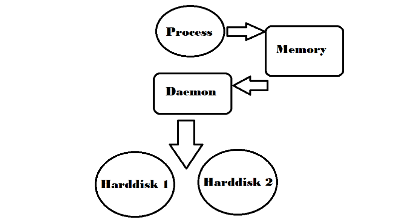

# Resumo SO2

#### Capitulo 3 : Virtualização

A virtualização usa software para dividir o hardware de um computador em várias máquinas virtuais (VMs). Isso permite que recursos como processador, memória e armazenamento sejam utilizados como se fossem computadores separados com cada um executando o seu próprio sistema operacional(SO).

Segundo Tanenbaum o SO é a abstração do Hardware ou seja uma simplificação da complexidade da parte física do computador, Segundo Tanenbaum, as abstrações permitem isolar processos em "Caixas de Areia", que são ambientes controlados onde os processos podem ser executados de forma segura, sem interferir no sistema ou em outros processos.

**Failover** é um mecanismo de segurança que garante a continuidade de um serviço ou sistema em caso de falhas. Ele funciona transferindo automaticamente a operação para um sistema ou componente de backup quando o principal apresenta problemas. É amplamente utilizado em ambientes de alta disponibilidade, como servidores, bancos de dados e redes, para minimizar o tempo de inatividade.

Um hipervisor é o software que gerencia as máquinas virtuais (VMs), conectando-as ao hardware físico. Ele garante que cada VM tenha acesso aos recursos necessários e impede que interfiram umas nas outras, como no uso de memória ou processamento. Existem dois tipos de Hipervisor:
- Hipervisor tipo 1: Este interage com os recursos fisicos, substituindo o SO por completo. Eles geralmente aparecem em cenários de servidor virtual.
- Hipervisor tipo 2: Estes são executados como aplicativos em SO`s existentes. São mais utilizados em dispositivos terminais para executar SO´s alternativos

#### Capitulo 4 : Sistema de arquivos no Debian GNU/Linux

No GNU/Linux, um sistema de arquivos organiza dados em unidades de armazenamento, enquanto uma partição é uma divisão da memória que armazena dados específicos. O sistema de arquivos precisa organizar os dados de forma eficiente para facilitar o acesso rápido aos arquivos.

O computador armazena dados na memória principal, que perde as informações ao ser desligado. Por isso, o armazenamento secundário é preferido. No entanto, a arquitetura do computador exige que instruções e dados fiquem na memória principal para serem usados.



Um processo que executa operações de I/O em um sistema secundário utiliza o Virtual File System para executar tais operações.
O **File System** (sistema de arquivos) não é exatamente um arquivo, mas sim o método ou estrutura usada por um sistema operacional para organizar, armazenar e acessar dados em dispositivos de armazenamento, como discos rígidos, SSDs ou pen drives. Ele define como os dados são gravados, lidos e organizados no dispositivo.

Um **arquivo File System** pode se referir a um arquivo usado por alguns sistemas para simular um sistema de arquivos, como em máquinas virtuais ou sistemas emulados, mas o termo mais geral diz respeito ao conjunto de regras e estruturas que gerenciam o armazenamento. Exemplos incluem **NTFS** (Windows), **ext4** (Linux) e **FAT32** (ambos).

Um **i-node** é uma estrutura de dados que descreve objetos do sistema de arquivos, como arquivos, diretórios ou links. No Unix, segundo Tanenbaum, o i-node é um registro que inclui um número e o nome de um arquivo.

Saiba que o número de i-nodes tem um limite, geralmente é uma divisão média do espaço da partição pelo tamanho médio dos blocos, geralmente o tamanho médio dos blocos por padrão é 4096 bytes.

Um diretório é um arquivo que organiza informações sobre o sistema de arquivos. Arquivos regulares podem conter dados ou serem executáveis. Segundo o livro **Sistemas Operacionais Modernos**, o que define um arquivo como executável para o sistema operacional é a presença de um "bit mágico" ativado em uma posição específica.

No GNU/Linux, ao abrir um arquivo, ele não é carregado na memória, mas recebe um número de referência (um descritor de arquivo). A função `open()` retorna esse número, que usamos para operar no arquivo. Ao copiar, podemos processar o arquivo em blocos de 4 KB.

Caso queira realizar testes de script, navegue ao diretório `/tmp` primeiro, porque neste diretório, tudo será automaticamente excluido após a inicialização.

Arquivos especiais de Bloco e Caracter são arquivos especiais que referenciam dispositivos de I/O, estes arquivos possuem referência no diretório `/dev` .

Segundo Tanenbaum, dispositivos de bloco realizam operações de entrada e saída em blocos de bytes, enquanto dispositivos de caractere operam com um byte por vez.

No Linux encontrar arquivos sem extensão pode se tornar comum, o comando `file` pode te ajudar a ver do que se trata o arquivo, um exemplo seria `file /etc/passwd` isso retornaria em que charset está o arquivo, nesse caso retornaria `ASCII text`, pois o texto encontrado está em ASCII, já o comando `stat` informa coisas como:
- tamanho do arquivo
- permissões de acesso
- ID do usuário e do Grupo
- Hora em que foi criado
- Hora em que foi acessado

Caso necessite compilar um arquivo c++ no terminal linux o comando seria:
1. g++ -o arquivo arquivo.cpp
2.  ./arquivo

Arquivos e diretórios tem 3 tipos de permissão (PADRÃO):
Read (r): permissão de leitura;
Write (w): permissão de escrita;
Execute (x): permissão de executar se for um arquivo e permissão de listagem caso seja um diretório;

Cada arquivo e diretório define seu controle de acesso por 3 classes:
User (u): é o proprietário do arquivo.
Group (g): é o grupo dono do arquivo, e dentro do grupo pode conter vários usuários.
Others (o): são todos os outros usuários que não se enquadram nos dois casos acima.

outra forma de mostrar as permissões são pelos números que as representam:
- 0 - Nenhuma permissão de acesso	
- 1 - Permissão de execução				x
- 2 - Permissão de gravação				w
- 3 - Permissão de gravação e execução		wx
- 4 - Permissão de leitura				r
- 5 - Permissão de leitura e execução			rx
- 6 - Permissão de leitura e gravação			rw
- 7 - Permissão de leitura, gravação e execução	rwx

Em sistemas operacionais GNU/Linux, o comando chmod é usado para alterar o modo de acesso de um arquivo.
um exemplo de uso seria `chmod ug+x script.sh`, a qual estaria dando a permissão com chmod, ug seria para usuário e grupo e adicionando a eles com ' + ' a permissão de execução (x) com relação ao script.sh.

Por padrão ao ser criado um novo usuário este recebe a permissão `rw-r--r--` mas você pode usar o comando umask para determinar as permissões padrões de seu novo usuário.

O umask é o valor subtraído das permissões 666 (rw-rw-rw-) ao criar novos arquivos ou de 777 (rwxrwxrwx) ao criar novos diretórios. Nesse caso use o comando `umask -S` para inclusive ter uma visualização mais humana das permissões que tem, e a sua saida terá `u=rwx, g=rx, o=rx`, ou seja o usuário tem permissão de leitura, escrita e execução, enquanto todos os outros apenas podem ler e executar.

O comando chgrp no GNU/Linux é usado para alterar a propriedade do grupo de um arquivo ou diretório. Todos os arquivos pertencem a um proprietário e a um grupo e você pode definir o proprietário usando o comando chown.

O bit SetUID permite que um arquivo seja executado com as permissões do proprietário do arquivo, não do usuário que o executa. Ou seja, se um usuário comum executar um programa que tenha o SetUID ativado e o proprietário for o root, o programa será executado com permissões de root, permitindo ao usuário executar tarefas que normalmente só o root poderia fazer. Isso ocorre sem precisar usar o comando `sudo` ou estar logado como root.
- Exemplo de uso: ```chmod u+s path_do_arquivo```

O bit SetGID, quando usado em um arquivo, faz com que o programa seja executado com as permissões do grupo do proprietário do arquivo, e não do grupo do usuário que o executa. Em diretórios, ele faz com que os arquivos criados dentro do diretório herdem o grupo do diretório, em vez do grupo do usuário que criou o arquivo.
- Exemplo de uso: ```chmod g+s path_do_arquivo```.

Quando um diretório tem o sticky bit definido, seus arquivos podem ser excluídos ou renomeados apenas pelo proprietário do arquivo, pelo proprietário do diretório e pelo usuário root.
- Exemplo de uso: ```chmod o+t path_do_arquivo```.

os links são ponteiros que apontam para um arquivo ou diretório onde estiver. Criar links é uma espécie de atalho para acessar um arquivo. Existem 2 tipos de links:
- Hard Link: É o apontamento direto do para o arquivo no sistema de arquivos para um arquivo no sistema secundário de armazenamento, é permitido que um mesmo arquivo sistema secundário de armazenamento aparece inúmeras vezes no sistema de arquivos (na RAM) porém em pontos diferentes na árvore, todos os Hard Links de um arquivo possuem o mesmo número i-node. Exemplo de uso `ln <arquivo_origem> <arquivo_link>`

- Link simbolico: Um link simbólico é semelhante ao recurso de atalho de arquivo usado nos sistemas operacionais em geral. Cada arquivo link contém um valor i-node separado que aponta para o arquivo original. Da mesma forma que os Hard Links, todas as alterações nos dados de um dos arquivos são refletidas no outro mas a alteração é feita no arquivo e não no link.
Exemplo de uso `ln -s <arquivo_origem> <link_simbolico>`.

#### Capitulo 5 : Usuários GNU/Linux

Um UID é um número atribuído pelo GNU/Linux a cada usuário no sistema e este número é usado para identifica-lo no sistema e determinar quais recursos do sistema ele pode acessar, estas identificações estão armazenadas no arquivo `/etc/passwd`, arquivo este ao qual armazena informações dos usuários.

Já as informações de grupo ficam nop arquivo `/etc/group`.

O comando getent exibe entradas de bancos de dados configurados em arquivo /etc/nsswitch.conf incluindo o banco do grupo que podemos usar para consultar uma lista de todos os grupos. `getent group`.

O comando adduser pode ser utilizado para adicionar usuários e até grupos ao sistema operacional, sua sintaxe é simples conforme listagem abaixo.

1. sudo adduser [opções] LOGIN_DO_USUARIO_PRETENDIDO
2. sudo adduser --group [opções] NOME_DO_GRUPO_PRETENDIDO
3. sudo adduser [opções] LOGIN_DO_USUARIO_PRETENDIDO grupo

caso o comando adduser ou useradd seja usado com -D cria uma nova conta de usuario.

Grupos podem ser adicionados com o comando adduser ou addgroup, com adduser basta adicionar o comando --group antes do nome do grupo. e podem ser excluídos tanto com deluser como com delgroup, a regra é que um grupo que é default group de algum usuário existente não pode ser escolhido.

O comando usermod é um comando que permite modificar as informações de login de um usuário. A sintaxe do comando assume a seguinte forma: `sudo usermod [options] USER`.

Para adicionar um usuário existente a um grupo secundário, use as -a -G opções após o nome do grupo e o nome de usuário conforme exemplo: `sudo usermod -a -G alunos aluno`.

Para alterar o grupo default de um usuário, execute o comando usermod com o parâmetro -g seguida do nome do grupo e o nome de usuário conforme exemplo: `sudo usermod -g GROUP USER`.

Para alterar as informações de comentário sobre o usuário aluno, execute o comando com a opção -c, e em seguida pelo novo comentário e nome de usuário: `sudo usermod -c "O aluno que faz a aula" aluno`.

Se for necessário alterar o diretório inicial do usuário, execute o comando usermod com a opção -d seguida pelo caminho absoluto do novo diretório inicial e o nome do usuário: `sudo usermod -d /hd2/alunos/aluno aluno`. Por padrão, o comando não move o conteúdo do diretório inicial do usuário para o novo. Para mover o conteúdo, use a opção -m. Se o novo diretório ainda não existir, ele será criado: `sudo usermod -d /hd2/alunos/aluno -m aluno`.

Para alterar o shell padrão do usuário, execute o comando com a opção -s seguida do caminho absoluto do shell e o nome do usuário: `sudo usermod -s /usr/sbin/nologin aluno`.

Para alterar o UID do usuário, execute o comando com a opção -u seguida do novo UID e o nome do usuário: `sudo usermod -u 1300 aluno`.

Embora não seja muito frequente, às vezes você pode querer alterar o nome de um usuário existente. A opção -l é usada para alterar o nome de usuário: `sudo usermod -l aluno aprendiz`. No exemplo o aluno está sendo renomeado para aprendiz. Ao alterar o nome de usuário, você também pode alterar o diretório pessoal do usuário para refletir o novo nome de usuário.

Por exemplo, para desabilitar o usuário aluno2, você executaria o seguinte comando: `sudo usermod -e "2022-02-21" aluno2`. Para desativar a expiração deixe a data vazia.

A opção -L permite que você bloqueie uma conta de usuário. O comando deverá inserir um ponto de exclamação ! na frente da senha criptografada no arquivo /etc/shadown, o usuário não poderá fazer login no sistema usando autenticação de senha.
Para desbloquear um usuário, execute o comando com o parâmetro -U.

Para verificar o status da conta você pode usar o comando: `passwd -S`, caso retire o argumento -S, o comando sera para alterar a senha. e sendo assim, você pode alterar a senha de outro usuário usando: `sudo passwd usuario` e caso eu acrescente --expire após o passwd, o usuário será obrigado a trocar a senha em seu próximo login.

#### Capitulo 6 : Formatando e montando dispositivos em bloco

O ext foi criado por Rémy Card como uma alternativa ao sistema de arquivos MinixFS, usado nas primeiras versões do Linux. Baseado nos princípios do Berkeley Fast File System da BSD, o ext foi o primeiro sistema de arquivos mais avançado para Linux. Em março de 1993, o ext passou a competir com o ext2, introduzido na versão 0.99.7 do Linux.

O sistema de arquivos ext2 era padrão em várias distribuições GNU/Linux, incluindo Debian e Red Hat Linux, até ser suplantado por ext3, que é quase completamente compatível com ext2 e é um sistema de arquivos com journaling.

O padrão Ext3 é um padrão para o sistema de arquivos com journaling que é comumente usado pelo kernel do Linux e costumava ser o sistema de arquivos padrão para muitas distribuições populares do GNU/Linux. Sua principal vantagem sobre o ext2 é o registro no journaling, que melhora a confiabilidade e elimina a necessidade de verificar o sistema de arquivos após um desligamento incorreto.

Padrão Ext4 é um sistema de arquivos com journaling para Linux, desenvolvido como o sucessor do ext3. O ext4 era inicialmente uma série de extensões compatíveis com versões anteriores para ext3, muitas delas originalmente desenvolvidas por Cluster File Systems, destinadas a estender os limites de armazenamento e adicionar outras melhorias de desempenho. No entanto, outros desenvolvedores do kernel Linux se opuseram a aceitar extensões para ext3 por razões de estabilidade, e propuseram bifurcar o código-fonte do ext3, renomeá-lo como ext4.

Para exibir os dispositivos especiais de bloco, execute o comando lsblk: `sudo lsblk`
